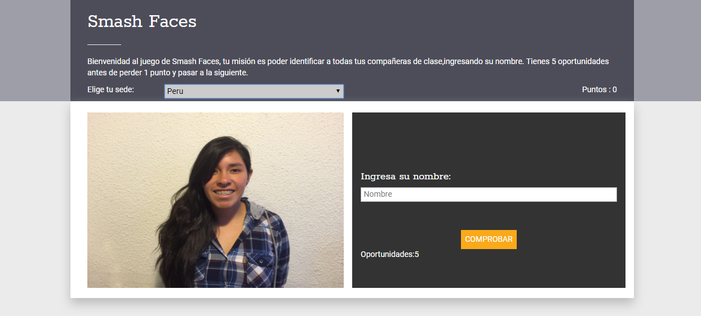

# Smash Faces

Es un juego interactivo creado con la intención de ayudar al salón de clases a que se
conozcan de una manera más fácil y divertida.

El juego consiste en adivinar los nombres de las compañeras de clase para lo cual
el programa te muestra la imagen de tu compañera y tu misión es adivinar su nombre,
cada nombre adivinado te da 5 puntos.

## Especificaciones Funcionales

* El proyecto esta dividido en cabecera y el juego.
* Para empezar a jugar debes elegir una sede para que cargue de manera aleatoria las
compañeras de clase.
* El jugador debe ingresar el texto en el input y debe darle click al boton comprobar
que le va a permitir verificar si es que el nombre es correcto o no.
* El jugador tiene 5 intentos como máximo antes que el sistema cambie de foto y le disminuye
1 punto.
* En caso el jugador acierte correctamente debe sumar 5 puntoss y debe mostrarse una foto
 diferente.

 Puedes revisar el proyecto y jugar con el en [Smash Faces](https://fiorellaqa.github.io/Smash-Faces/)

